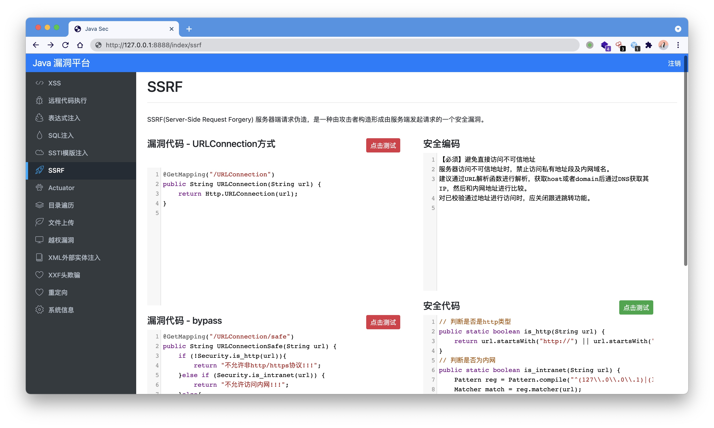

# ☕️ Hello Java Sec 
> 学习 Java 漏洞，记录一下代码




- 默认账号：admin/admin

## Vulnerability
- [ ] SQLi
- [x] XSS
- [x] RCE
- [x] SSTI
- [x] SpEL
- [x] SSRF
- [ ] Directory Traversal
- [x] Redirect
- [ ] CSRF
- [ ] File Upload
- [ ] XXE
- [x] Actuator
- [ ] Fastjson

## Run
### IDEA
配置数据库连接，数据库文件`db.sql`
```
spring.datasource.url=jdbc:mysql://127.0.0.1:3306/test
spring.datasource.username=root
spring.datasource.password=1234567
```

### Jar
```
git clone https://github.com/j3ers3/Hello-Java-Sec
mvn clean package -DskipTests
java -jar hello-0.0.1-SNAPSHOT.jar
```


## 环境
- Java 1.8
- SpringBoot 4.0
- Bootstrap 4.6.0
- Codemirror 5.62.0
- Fastjson 1.2.24