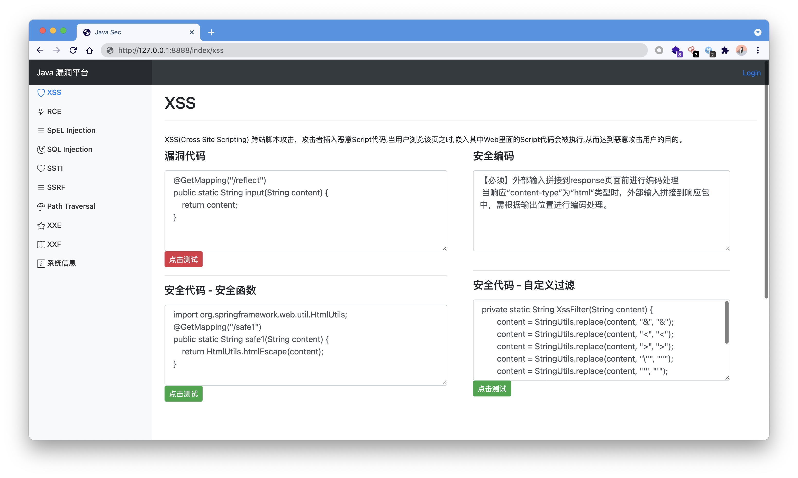

# Hello Java Sec 
> 学习 Java 漏洞，记录一下代码




## Vulnerability
- [ ] SQLi
- [x] XSS
- [x] RCE
- [x] SSTI
- [x] SpEL
- [ ] SSRF
- [ ] Directory Traversal
- [ ] Redirect
- [ ] CSRF
- [ ] File Upload
- [ ] XXE
- [ ] Fastjson

## Run
### IDEA
配置环境run即可

### Jar
```
git clone https://github.com/j3ers3/Hello-Java-Sec
mvn clean package -DskipTests
java -jar hello-0.0.1-SNAPSHOT.jar
```