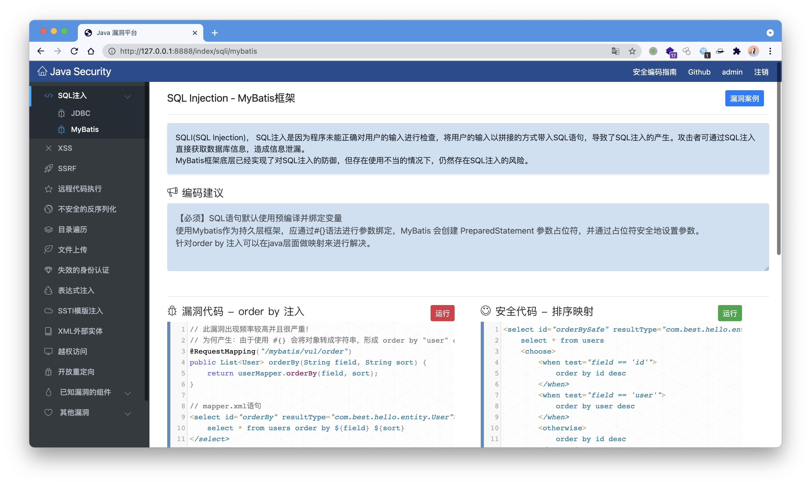
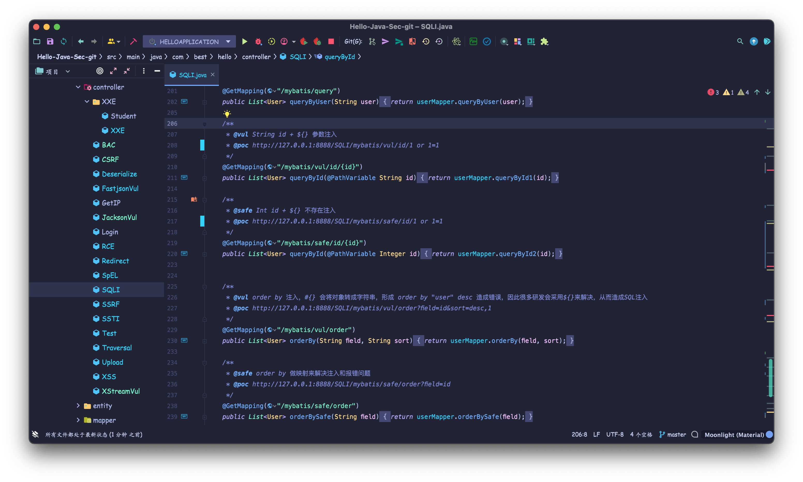

# ☕️ Hello Java Sec 
> Java漏洞平台，结合漏洞代码和安全编码，帮助研发同学理解和减少漏洞，代码仅供参考




- 默认账号：admin/admin

## Vulnerability
- [x] SQLi
- [x] XSS
- [x] RCE
- [x] Deserialize
- [x] SSTI
- [x] SpEL
- [x] SSRF
- [x] Directory Traversal
- [x] Redirect
- [ ] CSRF
- [x] File Upload
- [x] XXE
- [x] Actuator
- [x] Fastjson
- [x] Xstream
- [x] Log4shell
- [x] JNDI
- [x] 越权
- [x] Dos
- [ ] more



## Run
### IDEA
配置数据库连接，数据库文件`db.sql`
```
spring.datasource.url=jdbc:mysql://127.0.0.1:3306/test
spring.datasource.username=root
spring.datasource.password=1234567
```

### Jar
```
git clone https://github.com/j3ers3/Hello-Java-Sec
cd Hello-Java-Sec
mvn clean package -DskipTests
java -jar target/hello-1.0.0-SNAPSHOT.jar
```

### Docker
```
bash deploy.sh
```

## 技术架构
- Java 1.8
- SpringBoot 4.0
- Bootstrap 4.6.0
- Codemirror 5.62.0
