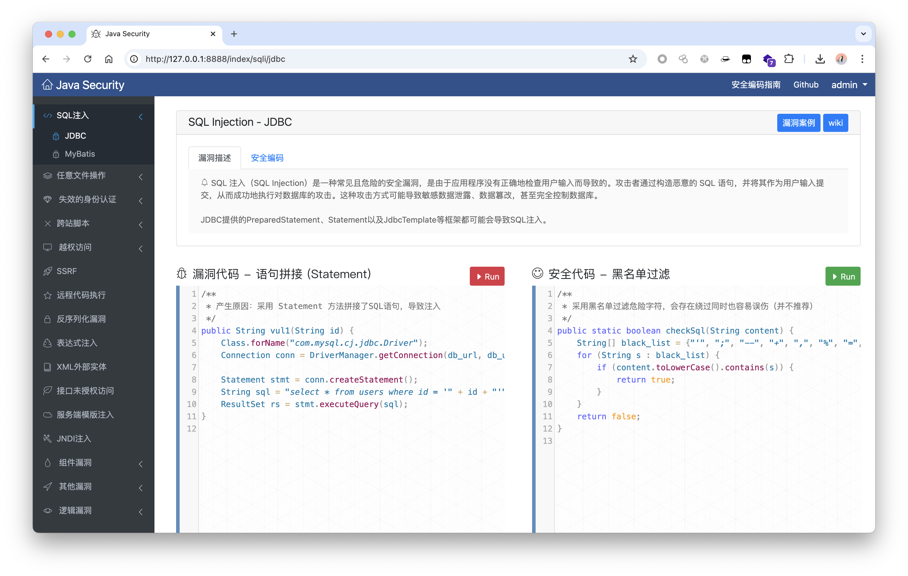
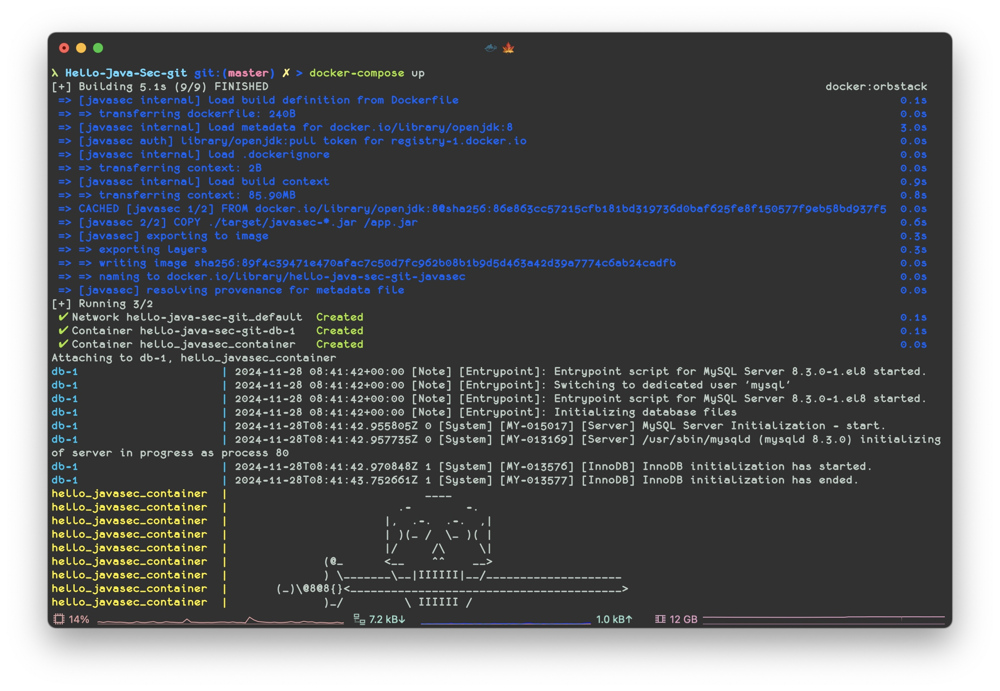

# ☕️ Hello Java Sec  

> Hello Java Security 通过结合漏洞场景和安全编码，帮助安全和研发团队理解漏洞原理，从而减少漏洞的产生，代码仅供参考 :)



- 默认账号：admin/admin

## Vulnerability

- [x] SQLi
- [x] XSS
- [x] RCE
- [x] Deserialization
- [x] SSTI
- [x] SpEL
- [x] SSRF
- [x] IDOR
- [x] Directory Traversal
- [x] Redirect
- [x] CSRF
- [x] File Upload
- [x] XXE
- [x] Actuator
- [x] Fastjson
- [x] Xstream
- [x] Log4shell
- [x] JNDI
- [x] Dos
- [x] Xpath
- [x] IPForgery
- [x] Jwt
- [x] Password Reset
- [ ] more and more


## Run

### 手工部署
配置数据库

导入数据库文件 `src/main/resources/db.sql`
配置数据库连接 `src/main/application.properties`

```
spring.datasource.url=jdbc:mysql://127.0.0.1:3306/test
spring.datasource.username=root
spring.datasource.password=1234567
```

编译并启动

> 使用JDK 1.8环境，高版本会报错

```
git clone https://github.com/j3ers3/Hello-Java-Sec
cd Hello-Java-Sec
mvn clean package -DskipTests
java -jar target/javasec-x.x.jar
```

### Docker部署

```
git clone https://github.com/j3ers3/Hello-Java-Sec
cd Hello-Java-Sec
mvn clean package -DskipTests
docker-compose up
```



## 技术架构

- Java 1.8
- SpringBoot 2.4.1
- Bootstrap 4.6.0
- Codemirror 5.62.0
